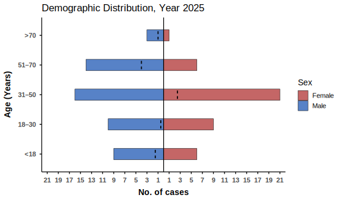
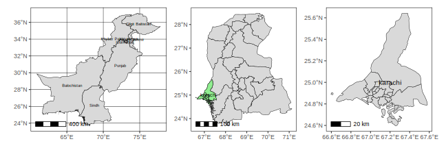

# R-code_snippets
## Correlation matrix plot
below correlation matrix plot was created in R using [correlation_plot.R](correlation_plot.R)  
  

##
## Demographic distribution plot
below demographic distribution plot was created in R using [barplot.R](barplot.R)  
  

##
## Pakistan/Sindh/Karachi Map
below Map was created in R using [map.R](map.R) script  
 